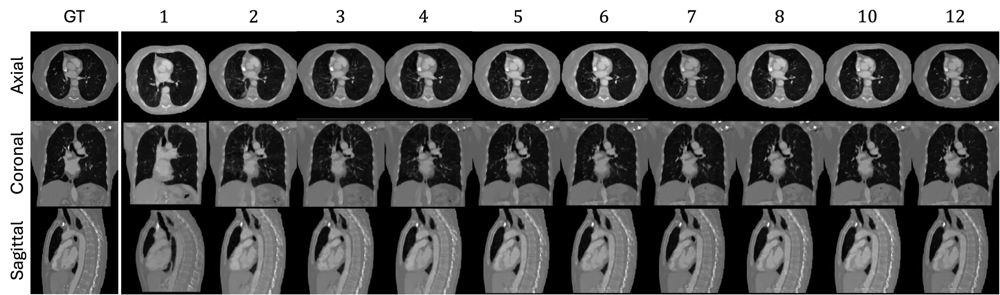
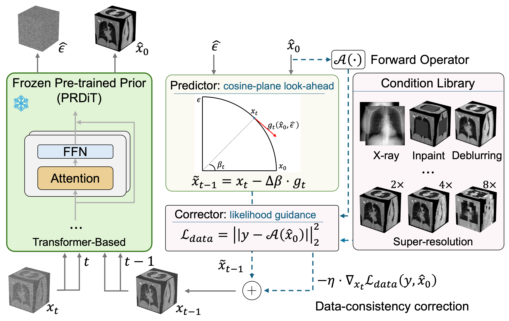
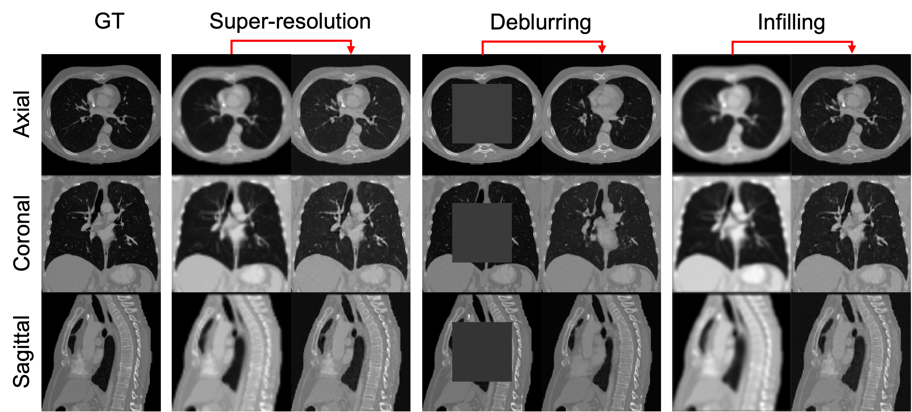
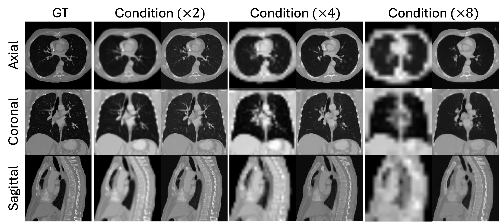
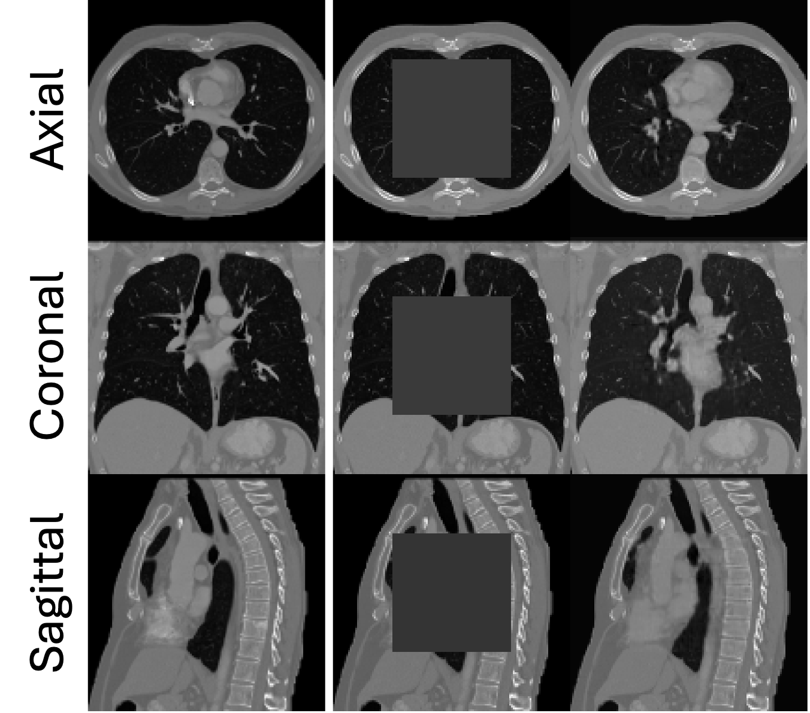
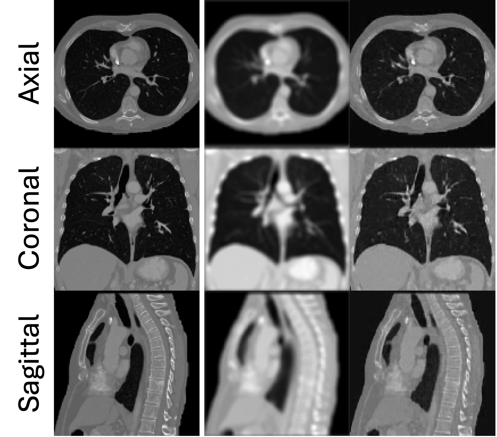
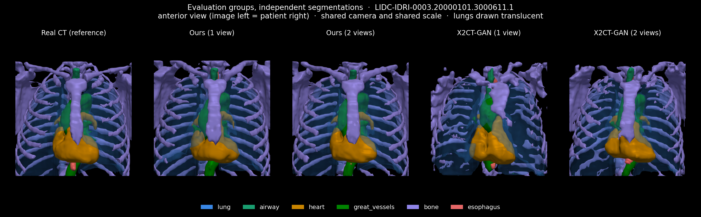

# TF-PRDiT

Official code for **From Sparse X-rays to 3D CT: Training-Free Reconstruction with Diffusion Priors**.

TF-PRDiT uses a pretrained 3D diffusion prior for sparse X-ray-to-CT reconstruction. This repository README is focused on the inference workflow: download the dataset, download pretrained weights, and run conditional sampling with different numbers of X-ray views.

Accepted at the **6th Deep Generative Models Workshop, MICCAI 2026**.

Paper: [OpenReview](https://openreview.net/forum?id=YbePHjhsMO) | [arXiv:2606.20763](https://arxiv.org/abs/2606.20763)

<p align="center">
  
</p>

## Model Structure

TF-PRDiT keeps a pretrained 3D DiT prior frozen during conditional sampling. For each reverse diffusion step, the sampler projects the current denoised CT estimate into X-ray space, compares it with the input sparse X-rays, and uses that consistency signal to guide the next CT estimate.

<p align="center">
  
</p>

The same sampling interface can guide the prior with different measurement operators. This README focuses on sparse X-ray-to-CT sampling.

<p align="center">
  
</p>

## Downstream Task Configs

In addition to sparse X-ray-to-CT sampling, the same frozen prior can be configured for volumetric super-resolution, infilling, and deblurring experiments. The downstream YAML files keep the same LIDC prior/data settings and add a `downstream` section describing the measurement operator.

| Task | Config | Figure |
|---|---|---|
| Super-resolution | `configs/lidc_downstream_super_resolution.yaml` | `assets/sr.png` |
| Infilling | `configs/lidc_downstream_infilling.yaml` | `assets/infilling.png` |
| Deblurring | `configs/lidc_downstream_deblurring.yaml` | `assets/deblurr.png` |

| Super-resolution | Infilling | Deblurring |
|---|---|---|
|  |  |  |

## Repository Layout

```text
configs/                  Sampling config files
datasets/                 Dataset loaders
diffusion/                Image-and-Noise diffusion and X-ray guided sampler
models/                   3D DiT model definitions
pretrained/               Pretrained checkpoint download instructions
scripts/                  Dataset download, utilities, and the evaluation suite
sample_xrays.py           Sparse X-ray-to-CT conditional sampling
sample_downstream.py      Super-resolution, infilling, and deblurring sampling
utils/download.py         Checkpoint loading helper
utils/metrics.py          HU conversion and tissue-band MAE/RMSE
utils/seg_metrics.py      TotalSegmentator metrics: Dice, IoU, HD95, ASSD, HU error
EVALUATION.md             How to run and read the evaluation
```

## Download Dataset

See [datasets/README.md](datasets/README.md) for the LIDC-IDRI download,
expected HDF5 layout, and configuration instructions.

## Download Pretrained Weights

Download the released TF-PRDiT sampling checkpoint from the
[pretrained weights folder on Google Drive](https://drive.google.com/drive/folders/1nWWjnogMB_H6tNuBJfSwzeccak2RUIig?usp=sharing)
and place it in `pretrained/`.

To download the shared folder from the command line:

```bash
pip install gdown

gdown --folder "https://drive.google.com/drive/folders/1nWWjnogMB_H6tNuBJfSwzeccak2RUIig" \
  -O pretrained
```

See [pretrained/README.md](pretrained/README.md) for the checkpoint folder convention.

## Conditional Sampling

Run sparse X-ray-to-CT reconstruction with:

```bash
python sample_xrays.py \
  --config lidc_stage2_global.yaml \
  --ckpt pretrained/tf_prdit_lidc.pt \
  --num-samples 100 \
  --num-sampling-steps 1000 \
  --rotations 2 \
  --output-dir outputs_Cond \
  --new
```

Use metrics-only mode to avoid saving intermediate PNG/NIfTI files:

```bash
python sample_xrays.py \
  --config lidc_stage2_global.yaml \
  --ckpt pretrained/tf_prdit_lidc.pt \
  --num-samples 100 \
  --rotations 2 \
  --output-dir outputs_metrics \
  --new \
  --no-save-intermediate
```

X-ray sampling is quiet by default. Add `--verbose` to show model, dataset,
DRR, and per-step diagnostic logs.

Run the other volumetric inverse problems with the same frozen checkpoint:

```bash
# 4x volumetric super-resolution
python sample_downstream.py \
  --task super_resolution \
  --config lidc_downstream_super_resolution.yaml \
  --ckpt pretrained/tf_prdit_lidc.pt \
  --scale-factor 4 \
  --num-samples 10 \
  --output-dir outputs_super_resolution

# Fill a centered region occupying 50% of each spatial dimension
python sample_downstream.py \
  --task infilling \
  --config lidc_downstream_infilling.yaml \
  --ckpt pretrained/tf_prdit_lidc.pt \
  --mask-type center \
  --mask-ratio 0.5 \
  --num-samples 10 \
  --output-dir outputs_infilling

# 3D Gaussian deblurring
python sample_downstream.py \
  --task deblurring \
  --config lidc_downstream_deblurring.yaml \
  --ckpt pretrained/tf_prdit_lidc.pt \
  --blur-kernel-size 5 \
  --blur-sigma 2.0 \
  --num-samples 10 \
  --output-dir outputs_deblurring
```

Task-specific operator settings are documented in the corresponding YAML files
under `configs/`; command-line values control the current run. Downstream tasks
use the guided sampling scheme by default, so no additional sampling-mode flag
is required. Console output is quiet by default; add `--verbose` to show model,
dataset, and per-step diagnostics. Empty output directories are removed
automatically after each run.

## Change X-ray View Number

Set `VIEWS` to the desired number of input X-rays and run the same command:

```bash
VIEWS=2

python sample_xrays.py \
  --config lidc_stage2_global.yaml \
  --ckpt pretrained/tf_prdit_lidc.pt \
  --num-samples 10 \
  --rotations "$VIEWS" \
  --output-dir "outputs_${VIEWS}views" \
  --new
```

Common settings:

| `VIEWS` | View selection |
|---:|---|
| `1` | One frontal view |
| `2` | Orthogonal views at 0° and 90° (default paper setting) |
| `N > 2` | Keeps 0° and 90° and distributes the remaining views across the rotation range |

The current sampler generates DRR/X-ray conditions from the CT volume in the dataset for each sample. To change the number of conditioning X-rays, change `--rotations`.

## Evaluation

`sample_xrays.py` reports MSE / PSNR / SSIM / SNR. Those say how close the voxels
are; they do not say whether the anatomy survived. A chest CT is ~30 % air and
~29 % homogeneous soft tissue, so a global error is dominated by voxels nobody
reads, and it cannot tell you that the bone is 100 HU too dark or that the trachea
was filled in with soft tissue.

The evaluation suite adds clinically interpretable metrics. It segments the
reconstruction and the real CT **independently** with
[TotalSegmentator](https://github.com/wasserth/TotalSegmentator) and compares the
label maps, over six structure groups (lung, airway, heart, great vessels, bone,
esophagus):

- **Structural / task-based** — **Dice**, **IoU**, HD95, ASSD, signed volume
  error, and a detection rate. Can say a structure is in the *wrong place*.
- **Intensity fidelity** — **MAE**, RMSE and signed **bias**, in HU, inside each
  structure. Bias is the informative one: it reveals systematic under-prediction
  that a symmetric MAE hides.

The example below compares independently segmented anatomy from the reference CT,
TF-PRDiT (ours), and X2CT-GAN under one- and two-view reconstruction settings.
All renderings use the same anterior viewpoint, camera, and scale.

<p align="center">
  
</p>

```bash
pip install TotalSegmentator
export TOTALSEG_HOME_DIR=$HOME/.totalsegmentator   # needed on nodes with no egress

# check the setup before trusting any number (spacing, axis order, metric maths)
python scripts/validate_eval_setup.py --with-segmentation

# segment the real test CTs once; everything else reuses this cache
python scripts/segment_real_testset.py --out-dir results/seg_real_128

# evaluate one run, or several at once -- this is how you get a view sweep
python scripts/evaluate_segmentation.py \
    --run 1view=outputs_1view --run 2view=outputs_2views --run 4view=outputs_4views \
    --out results/views.csv
python scripts/summarize_evaluation.py --csv results/views.csv
```

Segmentation needs a GPU; the tables do not. **Read Dice against
`scripts/eval_ceiling.py`, not against 1.0** — the 128³ grid alone costs the
segmenter a lot of overlap (bone tops out near 0.82). See
[EVALUATION.md](EVALUATION.md) for how to read the numbers, and for the reasons
that reference is a *scale* and not an upper bound.

## Useful Commands

```bash
python scripts/download_lidc_idri.py --help
python sample_xrays.py --help
python scripts/ct2xrays.py --help
python scripts/evaluate_segmentation.py --help
python scripts/validate_eval_setup.py --help
```

## Citation

```bibtex
@inproceedings{zhang2026from,
  title={From Sparse X-rays to 3D CT: Training-Free Reconstruction with Diffusion Priors},
  author={Zhenkai Zhang and Markus Hiller and Krista A. Ehinger and Tom Drummond},
  booktitle={6th Deep Generative Models Workshop for MICCAI 2026},
  year={2026},
  url={https://openreview.net/forum?id=YbePHjhsMO}
}
```
